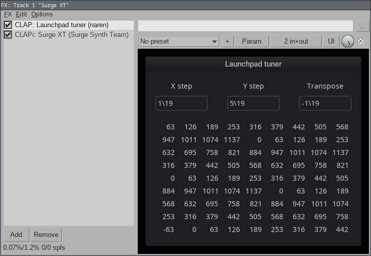

Launchpad tuner
===============

Audio plugin which lets you use a Novation Launchpad as an isomorphic keyboard.

There are three parameters:
- **X step** - the pitch change going one key across
- **Y step** - the pitch change going one key up
- **Transpose** - an overall shift in pitch

The plugin displays the pitch in cents (modulo 1200) for each Launchpad key in a grid.

Builds for Windows, Mac, and Linux are available on the releases page.

Steps and transpose can be entered in:

- Cents:


- EDO steps:



- Ratios:


The Launchpad needs to be in programmer mode.

The plugin acts as an MTS-ESP source so will only work with MTS-ESP compatible synths like Surge XT.


Build
-----

```console
    $ git clone --recurse-submodules https://github.com/narenratan/launchpad_tuner
    $ cd launchpad_tuner
    $ cmake -B build
    $ cmake --build build
```
